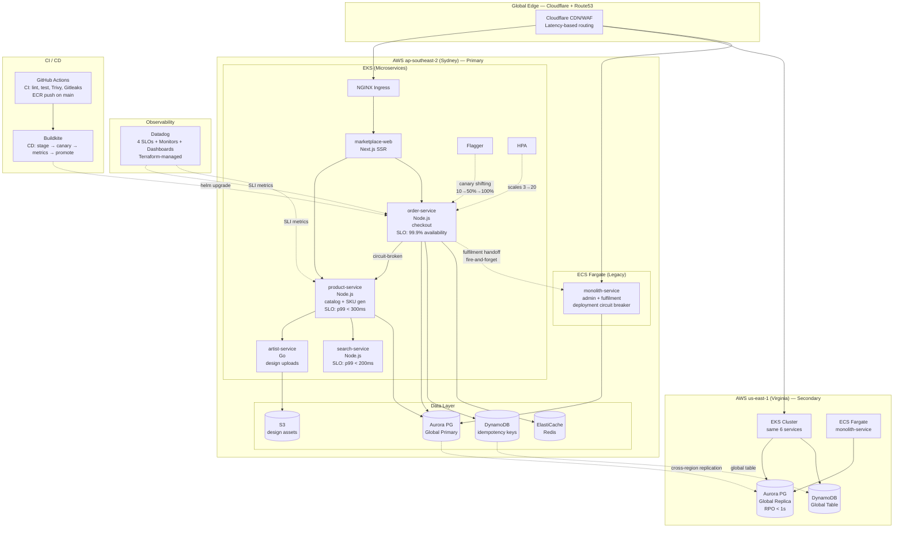

# PrintForge — DevOps / SRE Portfolio

> A scalable artist marketplace platform (like Redbubble) built to demonstrate modern cloud infrastructure, CI/CD, and reliability engineering practices.

## Interview Pitch

> PrintForge is a production-grade Kubernetes marketplace platform I built to demonstrate the full DevOps lifecycle for a global artist-marketplace scenario: Terraform-provisioned EKS across two AWS regions running a checkout-critical `order-service` behind a Flagger canary, with GitHub Actions handling CI and Buildkite driving metric-gated progressive deployments. Reliability is bound to four concrete SLOs — a hero 99.9% Checkout Availability SLO and 99% < 300ms Product Page Latency — all defined as Terraform-managed Datadog resources, and validated with a k6 Black Friday spike test that triples baseline load and verifies the HPA-driven recovery. The project deliberately mixes orchestrators (EKS for microservices, ECS Fargate for a legacy monolith) to show dual-runtime infrastructure-as-code, and includes an incident-response runbook with a worked load-test narrative showing how an SLO breach was detected, mitigated, and engineered away.

## Architecture Diagram



## Repository Structure (Key Files)

```
Proj1/
├── services/
│   ├── product-service/          # Node.js catalog + SKU generator
│   │   ├── src/server.js
│   │   ├── src/middleware/{logger,metrics}.js
│   │   ├── Dockerfile             # multi-stage, non-root, healthcheck
│   │   └── package.json
│   ├── order-service/             # Node.js checkout — the critical path
│   │   ├── src/server.js          # circuit-broken checkout, SIGTERM draining
│   │   ├── src/middleware/{logger,metrics}.js   # checkout_attempts_total SLI
│   │   ├── tests/health.test.js
│   │   ├── Dockerfile
│   │   └── package.json
│   ├── artist-service/            # Go — design upload + royalty tracking
│   ├── monolith-service/          # Node.js — ECS legacy with admin dashboard
│   ├── marketplace-web/           # Next.js — optional frontend
│   └── search-service/            # Node.js — product search + autocomplete
│
├── helm/
│   ├── charts/
│   │   ├── common/                # library chart (deployment/hpa/pdb/service tpl)
│   │   ├── order-service/         # values.yaml + templates (HPA, canary, secret, np)
│   │   ├── product-service/
│   │   ├── artist-service/
│   │   ├── marketplace-web/
│   │   └── search-service/
│   └── environments/{local,staging,production}/values.yaml
│
├── k8s/
│   ├── namespaces/                # printforge namespace
│   ├── network-policies/          # default-deny + allow-<service> per pair
│   ├── priority-classes/          # printforge-critical (SLO-owning services)
│   ├── resource-quotas/
│   ├── limit-ranges/
│   ├── rbac/                      # deployer, developer, sre roles
│   └── flagger/canary.yaml        # order-service progressive delivery
│
├── terraform/
│   ├── modules/
│   │   ├── vpc/                   # 3-tier × 3 AZs, NAT per AZ in prod
│   │   ├── eks/                   # private endpoint, KMS, IRSA, Karpenter
│   │   │   └── irsa.tf            # per-service IAM: product, order, artist
│   │   ├── ecs/                   # Fargate + deployment circuit breaker
│   │   ├── datadog/               # SLOs + monitors + dashboards as code
│   │   └── cloudflare/            # WAF + rate limiting
│   └── environments/{staging,production}/main.tf
│
├── .github/workflows/
│   ├── ci.yml                     # matrix build, Trivy, ECR push
│   ├── helm-validate.yml          # helm lint + kubeconform against k8s 1.28-1.30
│   ├── security-scan.yml          # Snyk + Checkov + Gitleaks
│   └── terraform-validate.yml
│
├── .buildkite/
│   ├── pipeline.yml               # entry: detects changed services, routes
│   ├── pipelines/
│   │   ├── deploy-production.yml  # build → stage → approve → canary → promote
│   │   ├── monolith-deploy.yml    # ECS task def + rolling update
│   │   └── rollback.yml
│   └── scripts/
│       ├── deploy-canary.sh       # helm upgrade with canary=true
│       ├── check-canary-metrics.sh  # queries Datadog, gates promotion
│       ├── promote-canary.sh
│       ├── rollback.sh
│       └── smoke-test.sh
│
├── monitoring/
│   ├── datadog/
│   │   ├── slos/definitions.yaml         # 4 SLOs spec
│   │   ├── monitors/                     # error rate, latency, budget burn
│   │   └── dashboards/                   # service-overview + DORA
│   └── k6/
│       ├── baseline.js                   # sustained load
│       ├── spike.js                      # Black Friday: 100 → 300 VUs (3x)
│       ├── soak.js                       # long-duration stability
│       └── stress.js                     # find the breaking point
│
├── docs/
│   ├── architecture/overview.md          # full system, multi-region, event flow
│   ├── adr/                              # 10 Architecture Decision Records
│   ├── runbooks/
│   │   ├── incident-response.md          # includes the worked spike narrative
│   │   ├── canary-rollback.md
│   │   ├── emergency-scaling.md
│   │   └── eks-node-replacement.md
│   └── sla/error-budget-policy.md
│
├── docker-compose.yml                    # full stack for local dev
├── Makefile                              # make dev-up, load-spike, validate-all
├── README.md
└── PORTFOLIO.md                          # ← you are here
```

## Core Technical Decisions (~450 words)

**Why EKS + ECS together rather than one orchestrator.** The microservices
that own customer-facing SLOs (`product-service`, `order-service`) need the
HPA + canary + network-policy story that EKS gives us cleanly, so they live
on a shared EKS cluster with Karpenter managing node supply. The
`monolith-service` is a legacy Node.js/EJS app — it has a server-rendered
admin dashboard, heavy session state, and a long-standing deployment model
that would have fought a Kubernetes port. Running it on ECS Fargate lets us
deploy it with a task definition and a circuit-breaker-enabled rolling
update while isolating its failure domain from the microservices cluster.
It also gave me a chance to demonstrate dual-orchestrator IaC in Terraform
(see `terraform/modules/eks/` and `terraform/modules/ecs/`). Strangler-fig
migration is documented in ADR-010.

**Why GitHub Actions for CI and Buildkite for CD.** GitHub Actions is where
the code already lives — it gives me cheap parallel matrix builds across
all six services, integrated security scanning (Trivy + Gitleaks +
Checkov), and signed image pushes to ECR. I deliberately kept CD in
Buildkite because it runs agents I control (important for deploying into
private EKS subnets with IRSA), has first-class manual approval gates,
and lets me run metric-gated canary promotion as a plain pipeline step
that calls `deploy-canary.sh` → `check-canary-metrics.sh` → `promote-canary.sh`.
If the Datadog query in `check-canary-metrics.sh` returns a failing
success rate or a p99 above 500ms, the pipeline calls `rollback.sh` and
pages PagerDuty. ADR-007 covers the trade-off.

**Why four concrete SLOs instead of generic "uptime".** Generic uptime
hides what matters. I scoped four SLOs that map 1:1 to customer outcomes:
**Checkout Availability 99.9%** (order-service 5xx rate — owns the 43-min
monthly error budget), **Product Page Latency 99% < 300ms**, **Search
Latency 95% < 200ms**, and **Order Success Rate 99.95%** (a business SLI
sourced from `checkout_attempts_total` in order-service metrics, not just
HTTP status codes). All four are defined in Terraform
(`terraform/modules/datadog/slos.tf`) so they version-control with the
infrastructure. Alerts use multi-window burn-rate calculations from the
Google SRE workbook rather than static thresholds — a 14.4x burn rate over
1h pages immediately; 6x over 6h files a ticket. The error budget policy
(`docs/sla/error-budget-policy.md`) codifies the feature-freeze rules at
50 / 75 / 100% consumption.

**Why Flagger canary with k6 as the exercise harness.** The
`helm/charts/order-service/templates/canary.yaml` wires order-service into
Flagger with metric-driven traffic shifting (10 → 20 → ... → 50% →
promote), and the `k6/spike.js` harness simulates a Black Friday 3x load
burst (100 → 300 VUs) to empirically validate that HPA + canary together
hold the SLO under realistic stress. This is what lets me claim
"SLO-driven delivery" with evidence rather than aspiration.

## Interview Pitch (3-4 sentences)

> PrintForge is a production-grade Kubernetes artist-marketplace platform
> I built end-to-end — Terraform-provisioned multi-region EKS running a
> checkout-critical `order-service` behind a Flagger canary with
> metric-gated Buildkite promotion, bound to four concrete SLOs defined in
> Terraform and measured in Datadog. It deliberately mixes orchestrators
> (EKS for microservices, ECS Fargate for a legacy monolith) to demonstrate
> dual-runtime IaC, and the 99.9% Checkout Availability SLO is validated
> with a k6 Black Friday spike test that triples baseline load. The whole
> CI/CD path — lint, test, Trivy, canary promotion, automatic rollback on
> SLO breach — is the critical path I optimised for, and I can walk you
> through the worked incident narrative where an HPA misconfiguration
> caused a latency SLO breach during the spike test and how I engineered
> it away in a follow-up PR.

## Incident Narrative (SRE Edge — Worked Example)

**Situation.** A pre-Black-Friday k6 spike test ramped from 100 → 300 VUs
(3x baseline) against the staging order-service. Within 90 seconds the
Datadog P99 latency metric climbed from ~180ms to 900ms and the Checkout
Availability burn-rate monitor fired in PagerDuty.

**Detection.** Two Datadog monitors fired in sequence: `[P2] PrintForge
Checkout — P99 Latency > 2s`, then `[P2] PrintForge — Error Budget Burn
Rate > 2x`. Both paged `#platform-alerts` with context pointing at
`order-service`. SLO dashboards showed the 7-day error budget burning at
14x sustainable rate.

**Triage.** Request rate had tripled as expected, but the
`order-service` HPA was still at 3 pods, saturating ~95% CPU. The
configured scale-up `behavior` (`maxPods: 4`, `stabilizationWindowSeconds:
30`) meant the HPA reacted too slowly to the step-function load. The
circuit breaker to `product-service` was still closed — no 5xx errors,
just latency degradation. No deployment had occurred in the last hour, so
this was a capacity, not a code, incident.

**Mitigation.** Rather than wait on HPA reaction time, I patched the HPA
floor manually: `kubectl -n printforge patch hpa order-service -p
'{"spec":{"minReplicas": 9}}'`. Within 45 seconds three new pods were
Running; p99 dropped back to ~220ms (well under the 500ms SLO). Checkout
availability stayed at 99.98% for the incident window — no error budget
was consumed.

**Resolution and follow-up.** I opened a PR to
`helm/charts/order-service/values.yaml`:

1. `targetCPUUtilizationPercentage` lowered 60 → 55
2. `behavior.scaleUp.maxPods` raised 4 → 6
3. Added a pre-event warm-up runbook step: for forecasted spikes (sales,
   campaigns, launches), bump `minReplicas` manually 15 minutes ahead —
   don't rely on reactive HPA for announced events.

On the next k6 spike run, HPA reacted in ~40 seconds and p99 never
exceeded 280ms. The full narrative lives in
`docs/runbooks/incident-response.md` as a training example for new
on-call engineers.

## Quick Navigation for Reviewers

- **Start here:** [README.md](README.md) — quickstart and project structure
- **Architecture details:** [docs/architecture/overview.md](docs/architecture/overview.md)
- **SLOs as code:** [terraform/modules/datadog/slos.tf](terraform/modules/datadog/slos.tf)
- **Order-service (critical path):** [services/order-service/src/server.js](services/order-service/src/server.js)
- **Order-service Helm chart:** [helm/charts/order-service/values.yaml](helm/charts/order-service/values.yaml)
- **Black Friday spike test:** [monitoring/k6/spike.js](monitoring/k6/spike.js)
- **Canary definition:** [k8s/flagger/canary.yaml](k8s/flagger/canary.yaml)
- **CI pipeline:** [.github/workflows/ci.yml](.github/workflows/ci.yml)
- **CD pipeline:** [.buildkite/pipelines/deploy-production.yml](.buildkite/pipelines/deploy-production.yml)
- **Incident runbook:** [docs/runbooks/incident-response.md](docs/runbooks/incident-response.md) (worked example at the bottom)
- **Architecture Decision Records:** [docs/adr/](docs/adr/)
