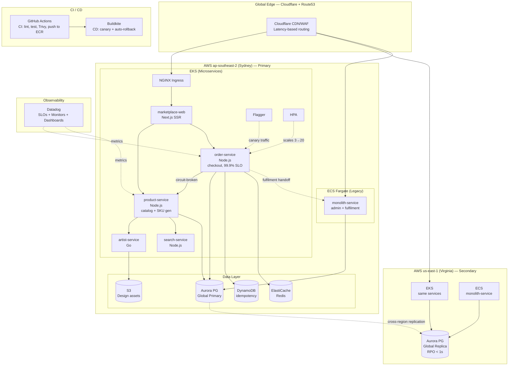

# PrintForge — Artist Marketplace Platform Infrastructure

> Production-grade infrastructure for a global print-on-demand artist marketplace (similar to Redbubble / TeePublic), demonstrating Kubernetes orchestration, CI/CD pipeline optimisation, SLO-driven observability, and infrastructure-as-code.

## Architecture Overview



## Core Services

| Service | Runtime | Purpose | SLO |
|---|---|---|---|
| `artist-service` | Go | Artist profiles, design uploads, royalty tracking | — |
| `product-service` | Node.js | Catalog, SKU generation from designs | 99% < 300ms p99 |
| `order-service` | Node.js | Checkout, payment orchestration, order lifecycle | **99.9% availability**, 99.95% success rate |
| `monolith-service` | Node.js (ECS Fargate) | Legacy admin, fulfilment, payouts | — |
| `marketplace-web` | Next.js | Storefront UI (optional frontend) | — |
| `search-service` | Node.js | Product search + autocomplete | 95% < 200ms |

## Quick Start

### Prerequisites
- Docker & Docker Compose
- kubectl & Helm 3
- Kind (for local K8s)
- Terraform >= 1.5
- Go >= 1.21
- Node.js >= 20

### Local Development (Docker Compose)
```bash
cp .env.example .env
make dev-up          # Start all services
# Browse: http://localhost:3000 (marketplace-web)
# product-service:  http://localhost:3001
# order-service:    http://localhost:3003
make dev-logs        # Tail logs
make dev-down        # Stop all services
```

### Local Kubernetes (Kind)
```bash
make k8s-up          # Create Kind cluster with ingress + Flagger
make k8s-deploy      # Deploy all services via Helm
make k8s-status      # Check pod status
make port-forward    # Access marketplace at localhost:3000
make k8s-down        # Tear down cluster
```

### Validate Everything
```bash
make validate-all    # Run all validations
make helm-lint       # Lint all Helm charts
make tf-validate     # Validate Terraform
make test-all        # Run all tests
make smoke-test      # Hit health endpoints
```

### Run the Black Friday Spike Test
```bash
make load-spike      # 3x load on order-service checkout path
# Watches: checkout_success_rate, checkout_p99, HPA reaction
```

## Project Structure

| Directory | Purpose |
|-----------|---------|
| `services/` | 6 services: `product-service`, `order-service`, `artist-service`, `monolith-service` (ECS), `marketplace-web`, `search-service` |
| `helm/` | Helm library chart + per-service charts with HPA, PDB, canary, network policies |
| `k8s/` | Cluster-level manifests: RBAC, network policies (default-deny), quotas, priority classes |
| `terraform/` | IaC modules: VPC, EKS, ECS, RDS, Cloudflare, Datadog; per-env compositions |
| `.buildkite/` | CD pipelines: canary deployment, rollback, monolith deploy |
| `.github/` | CI workflows: lint, test, Trivy, Gitleaks, Helm validate, Terraform validate |
| `monitoring/` | Datadog dashboards, monitors, SLO definitions, k6 load tests (spike / soak / stress) |
| `docs/` | ADRs, runbooks, architecture overview, onboarding guides |
| `platform/` | Developer self-service: service template, CLI tool |

## Key Infrastructure Highlights

### Kubernetes Hardening
- **Network Policies**: Default-deny ingress+egress with explicit allow rules per service pair (e.g., `order-service` → `product-service` only)
- **Pod Security**: Non-root containers, read-only root filesystem, dropped capabilities, seccomp
- **Topology Spread**: Pods distributed across 3 AZs for resilience
- **Resource Management**: Quotas, limit ranges, and priority classes (`printforge-critical` for SLO-owning services)
- **Rolling Updates**: `maxSurge: 1, maxUnavailable: 0` → zero-downtime deploys

### CI/CD Pipeline
- **GitHub Actions (CI)**: Parallel matrix builds across all 6 services, Trivy security scanning (fails on CRITICAL/HIGH), Helm/Terraform validation, Gitleaks secret scan
- **Buildkite (CD)**: Canary deployments with Flagger — Datadog metric-driven promotion (10% → 20% → 30% → 40% → 50% → 100%)
- **Automated Rollback**: SLO breach (success rate < 99.9% or p99 > 500ms) triggers immediate rollback + PagerDuty alert + Slack notification

### SLO-Driven Observability
- **4 SLOs**:
  - **Checkout Availability 99.9%** (order-service — the hero SLO)
  - **Product Page Latency** — 99% < 300ms (product-service)
  - **Search Latency** — 95% < 200ms (search-service)
  - **Order Success Rate 99.95%** (order-service — business SLI)
- **Error Budget Policy**: Automated responses at 50%, 75%, 100% budget consumption
- **DORA Metrics**: Deploy frequency, lead time, MTTR, change failure rate

### Infrastructure as Code
- **Terraform Modules**: VPC (3-tier × 3 AZs), EKS (private endpoint, KMS, Karpenter, IRSA), ECS (Fargate + circuit breaker for rollback), Cloudflare (WAF, rate limiting), Datadog (SLOs + monitors + dashboards)
- **Multi-Region**: Parallel stacks for ap-southeast-2 (Sydney) and us-east-1 (Virginia); Route53 latency-based routing; Aurora Global Database with < 1s RPO

### Event-Driven Flow (Artist Upload → Product Listing)

1. Artist uploads a design to `artist-service`, which persists it in S3 + Aurora and publishes `DesignUploaded` to SNS.
2. `product-service` consumes from SQS, generates SKU variants (t-shirt, mug, phone case, poster, …), and persists them, then publishes `ProductCreated`.
3. `search-service` consumes `ProductCreated` and indexes the new SKUs in OpenSearch — the new products are searchable within seconds.

See [`docs/architecture/overview.md`](docs/architecture/overview.md) for full sequence diagrams.

## Portfolio Deliverables

If you landed here from a résumé or interview context, start with these:

- 📄 [`PORTFOLIO.md`](PORTFOLIO.md) — 3-4 sentence interview pitch, core technical decisions writeup (300-500w), consolidated architecture diagram, and the incident response narrative
- 🗺️ [`docs/architecture/overview.md`](docs/architecture/overview.md) — full architecture with mermaid diagrams for service map, multi-region topology, event flow, deployment flow, and network topology
- 📋 [`docs/adr/`](docs/adr/) — 10 Architecture Decision Records covering why EKS for microservices vs ECS for monolith, why Flagger canary vs Argo Rollouts, why SLO-based alerting, why Karpenter, etc.
- 🚨 [`docs/runbooks/incident-response.md`](docs/runbooks/incident-response.md) — includes a worked load-test incident narrative
- 📊 [`terraform/modules/datadog/slos.tf`](terraform/modules/datadog/slos.tf) — the SLO contract as code

## License
MIT
