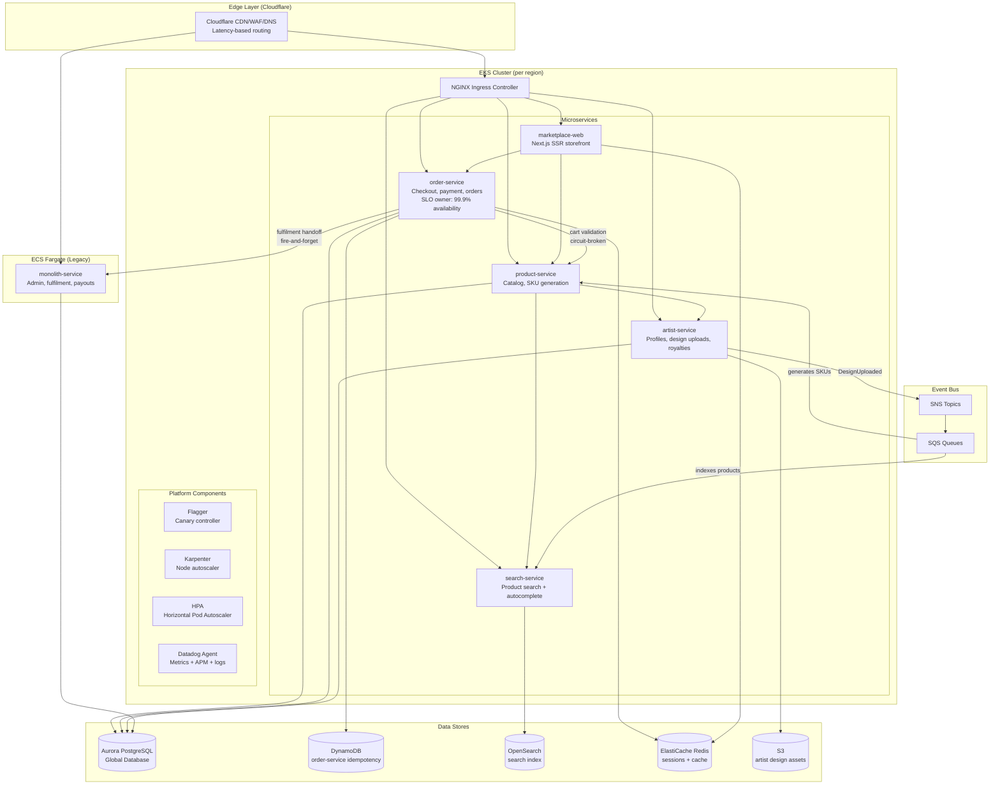
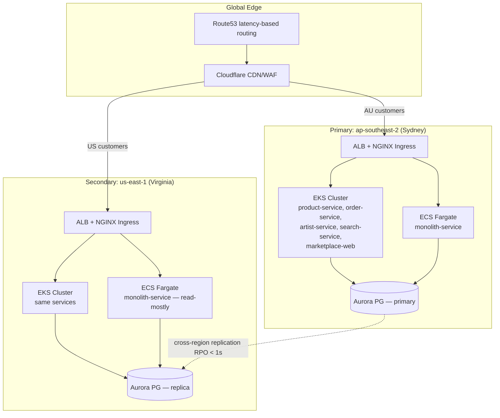
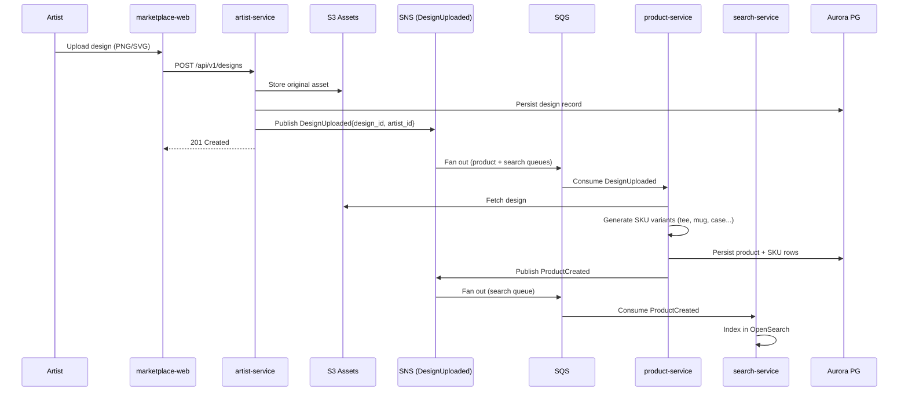
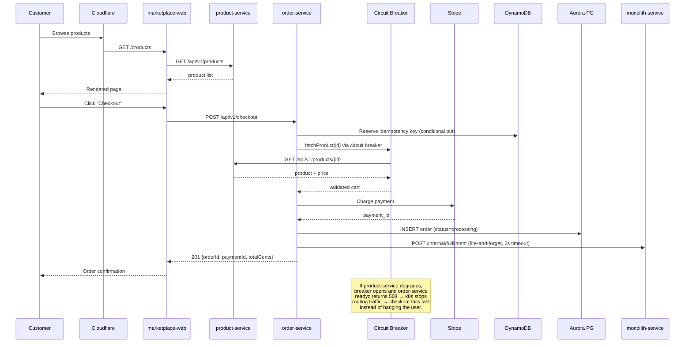
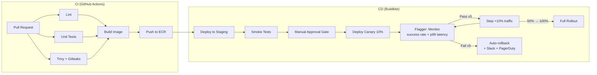
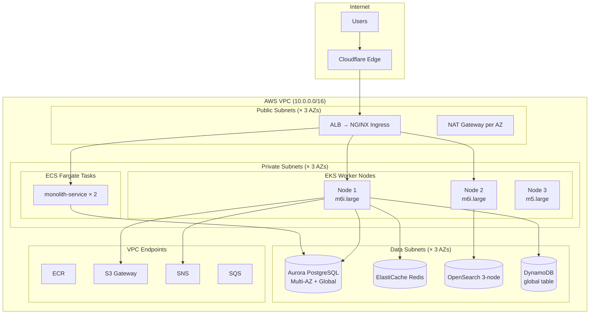

# PrintForge Architecture Overview

**Last Updated**: 2026-04-09
**Owner**: Platform Engineering Team

## System Overview

PrintForge is a print-on-demand marketplace connecting artists with customers.
Artists upload designs via `artist-service`; `product-service` dynamically
generates SKUs (t-shirts, phone cases, posters, etc.) from those designs;
`order-service` handles customer checkout; and a legacy `monolith-service`
runs on ECS Fargate for admin, back-office, and fulfilment workflows that
haven't yet been decomposed.

The platform is designed for a global audience with primary regions in
**ap-southeast-2 (Sydney, AU)** and **us-east-1 (Virginia, US)**. Route53
latency-based routing steers each customer to the closest region, and an
Aurora Global Database replicates state across regions with < 1s RPO for
cross-region failover.

## Service Map

## Multi-Region Topology

**Failover model:** If the primary region degrades, a Route53 health check
flips DNS weights to US within ~60s. Aurora Global Database promotes the US
replica to writer (managed failover takes < 2min). Checkout writes go to the
new primary; the order-service uses DynamoDB Global Tables for idempotency
keys, so in-flight duplicate-check state follows customers across regions
without the risk of double-charging during failover.

## Event-Driven Flow: Artist Upload → Product Listing

## Data Flow: Customer Checkout

## Deployment Flow

## Network Topology (Single Region)

## Infrastructure Components

### Compute

| Component | Type | Purpose | Scaling |
|---|---|---|---|
| EKS Worker Nodes | EC2 (Karpenter-managed) | Microservices hosting | Karpenter auto-provisioning |
| ECS Fargate Tasks | Fargate | `monolith-service` | Application Auto Scaling (CPU target 70%) |
| HPA (product-service) | Kubernetes HPA | Horizontal scaling | CPU 70%, min 3 / max 10 |
| HPA (order-service) | Kubernetes HPA | Horizontal scaling | CPU 60%, min 3 / max 20 |

### Data Stores

| Store | Type | Purpose | HA Configuration |
|---|---|---|---|
| Aurora PostgreSQL | Aurora Global Database | Products, orders, artists, royalties | Multi-AZ + cross-region replica |
| DynamoDB | DynamoDB Global Table | order-service idempotency keys | Global, active-active |
| OpenSearch | Amazon OpenSearch 2.11 | Product search index | 3-node cluster, 1 replica shard |
| Redis | ElastiCache Redis 7 | Sessions, cart state, rate limits | Cluster mode, 2 shards |
| S3 | Standard + Cross-Region Replication | Artist design assets | 99.999999999% durability |

### Networking

| Component | Purpose |
|---|---|
| Cloudflare | CDN, WAF, DNS, DDoS protection, bot management, latency-based routing |
| AWS ALB | Load balancing for EKS ingress and ECS monolith |
| NGINX Ingress | Kubernetes ingress routing, TLS termination |
| Calico | Network policy enforcement (default-deny ingress+egress) |
| VPC Endpoints | Private connectivity to AWS services |
| NAT Gateway | Outbound internet for private subnets (per AZ in prod) |

### Observability

| Tool | Purpose | Data Retention |
|---|---|---|
| Datadog | Metrics, APM, logs, SLOs, dashboards | 30 days (metrics), 15 days (logs) |
| CloudWatch | ECS metrics, VPC flow logs | 90 days |
| Flagger | Canary analysis + automatic rollback | N/A |

### CI/CD

| Tool | Purpose |
|---|---|
| GitHub Actions | CI: lint, test, build, Trivy scan, Gitleaks, ECR push |
| Buildkite | CD: staging deploy, canary deploy, metric-gated promotion, rollback |
| Helm | Kubernetes package management (library chart pattern) |
| Flagger | Progressive delivery controller (metric-driven traffic shifting) |
| ECR | Container image registry (per-region, with replication) |

## SLOs (Service Level Objectives)

| SLO | Target | Owner | Error Budget (30d) |
|---|---|---|---|
| **Checkout Availability** | 99.9% | order-service | 43.2 min |
| **Product Page Latency** | 99% < 300ms | product-service | — |
| **Search Latency** | 95% < 200ms | search-service | — |
| **Order Success Rate** | 99.95% | order-service | 21.6 min (biz SLI) |

See `docs/sla/error-budget-policy.md` for the error budget policy, and
`terraform/modules/datadog/slos.tf` for the authoritative definitions.

## Security Architecture

### Authentication and Authorization

- Cloudflare WAF filters malicious traffic at the edge
- NGINX Ingress handles TLS termination within the cluster
- Service-to-service communication uses internal ClusterIP services (no external exposure)
- API authentication via JWT tokens issued by the auth module
- AWS IAM roles for service accounts (IRSA) for AWS API access
  - `product-service` → S3 read for product images
  - `order-service` → Secrets Manager (Stripe key), DynamoDB (idempotency)
  - `artist-service` → S3 write for design uploads

### Network Security

- Default-deny NetworkPolicies on the `printforge` namespace
- Explicit allow rules per service pair (e.g., order-service → product-service only)
- VPC security groups restrict traffic between subnets
- VPC endpoints for AWS service access (no public internet traversal)
- Cloudflare Origin CA certificates for end-to-end TLS

### Container Security

- Non-root containers enforced via Helm library chart defaults (ADR-004)
- Read-only root filesystem
- Trivy vulnerability scanning in CI pipeline (fails on CRITICAL/HIGH)
- ECR image scanning enabled
- Pod Security Standards enforced (restricted profile)

## Environment Strategy

| Environment | Infrastructure | Purpose | Data |
|---|---|---|---|
| **Production** | EKS + ECS on AWS (AU + US) | Live customer traffic | Real data |
| **Staging** | EKS on AWS (AU only, smaller) | Pre-production validation | Sanitized copy of prod |
| **Development** | Kind cluster (local) | Local development | Seed data |

## Key Design Decisions

For detailed rationale behind architectural choices, see the Architecture Decision Records:

- [ADR-001: Microservices Split](../adr/001-microservices-split.md)
- [ADR-002: EKS for Micro, ECS for Mono](../adr/002-eks-for-micro-ecs-for-mono.md)
- [ADR-003: Flagger Canary Deployments](../adr/003-flagger-canary-deployments.md)
- [ADR-004: Helm Library Chart](../adr/004-helm-library-chart.md)
- [ADR-005: Network Policy Default Deny](../adr/005-network-policy-default-deny.md)
- [ADR-006: SLO-Based Alerting](../adr/006-slo-based-alerting.md)
- [ADR-007: Buildkite for CD, GitHub Actions for CI](../adr/007-buildkite-cd-github-ci.md)
- [ADR-008: Cloudflare Edge Layer](../adr/008-cloudflare-edge-layer.md)
- [ADR-009: Karpenter over Cluster Autoscaler](../adr/009-karpenter-over-cluster-autoscaler.md)
- [ADR-010: Monolith Migration Strategy](../adr/010-monolith-migration-strategy.md)
